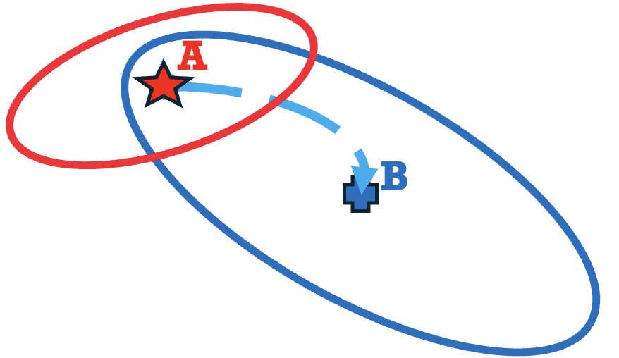
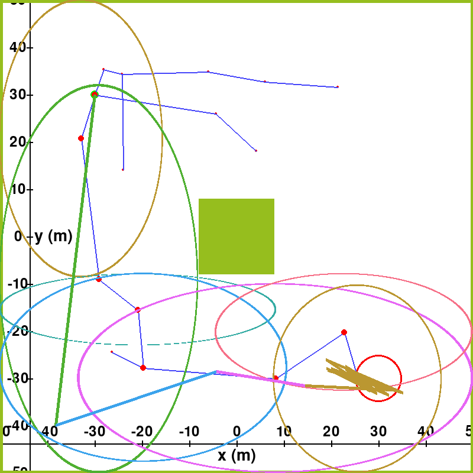
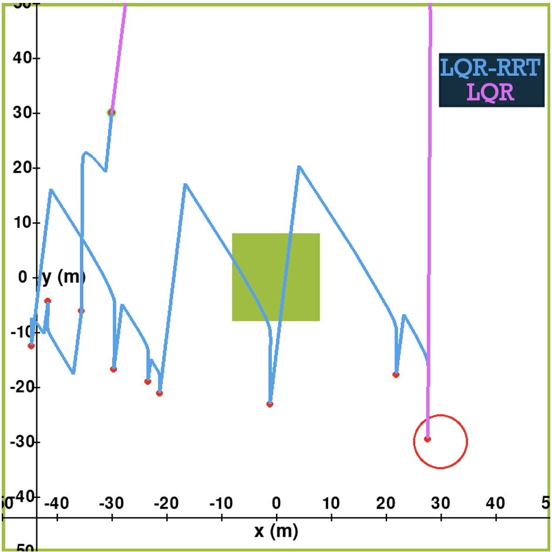

# SODA-RRT: Safe Optimal Dynamics-Aware Motion Planning

This project presents a performance-aware motion planning approach that generates collision-free paths with guaranteed performance using invariant sets. Specifically, the presented planner connected conflict-free invariant sets inside which closed-loop trajectories respect safety and optimality. Waypoints are randomly generated and invariant sets are formed for them and are connected to create a sequence of invariant sets from the initial to the target point. For each waypoint, an optimization problem finds the largest conflict-free zone and a safe-optimal controller. The presented algorithm, called safe optimal dynamics-aware motion planning SODA-RRT, accounts for the performance-reachability of connected waypoints, removing the need for frequent re-planning. Its effectiveness is demonstrated through spacecraft motion planning to avoid debris.

<div style="text-align:center;">
    
</div>

## Installation

### Cloning the Project

First, clone the repository to your local machine:

```bash
git clone https://github.com/your-username/your-repository.git
cd SODA-RRT
```


### Conda Environment

Before proceeding, ensure that you have Conda installed. If not, you can download and install it from [here](https://docs.conda.io/en/latest/miniconda.html).

To set up the Conda environment for this project, run the following commands:

```bash
conda env create -f SODA.yml
conda activate SODA
```

## Obtaining and Licensing MOSEK 

MOSEK is a powerful optimization solver that can be used with MATLAB to solve various mathematical optimization problems. To get started with MOSEK for MATLAB, follow these steps:

### 1. Download MOSEK

1. Visit the MOSEK download page: [MOSEK Download](https://www.mosek.com/downloads/).

2. Select the appropriate version of MOSEK for your operating system. MOSEK provides versions for Windows, Linux, and macOS.

3. Download the MOSEK installation package.

### 2. Install MOSEK

Follow the installation instructions provided by MOSEK to install the software on your system.

### 3. Obtain a License

1. MOSEK requires a license to use. You can request a free academic license, a trial license, or purchase a commercial license.

2. To request an academic license or a trial license, visit the MOSEK License Request page.

3. Follow the steps on the license request page to obtain your license file. This file will be used to activate MOSEK on your machine.

4. If you decide to purchase a commercial license, contact MOSEK directly through their website for more information on pricing and licensing options.


## Usage

To run the simulation and visualize the results, execute the main script:

```bash
python RRT_EL_spaceCraft_comparison.py
```

## Citation
If you found this page useful for your research, please cite it as:

(submitted and waiting for the citation information)

## License

This project is licensed under the [MIT License] - see the [LICENSE.md](LICENSE) file for details.

## Results


<center>
  <table>
    <tr>
      <td align="center">
        
        <br>
        <em>SODA-RRT Algorithm; ellipsoidal sets and trajectories.</em>
      </td>
      <td align="center">
        
        <br>
        <em>LQR with RRT waypoints and LQR Algorithm trajectories.</em>
      </td>
    </tr>
  </table>
</center>


